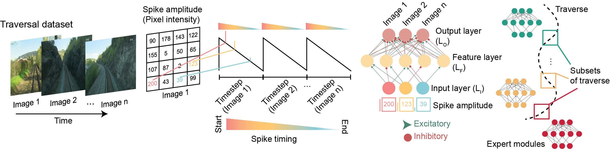
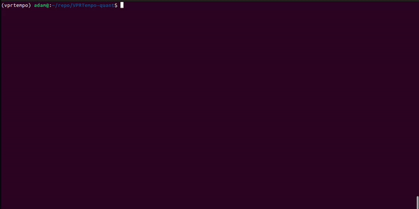
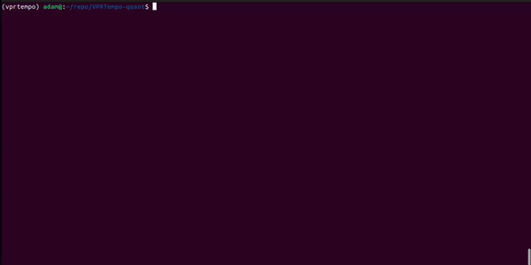
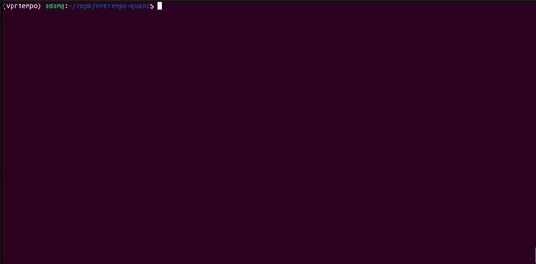

# VPRTempo - A Temporally Encoded Spiking Neural Network for Visual Place Recognition

[](https://creativecommons.org/licenses/by-nc-sa/4.0/)
[](https://github.com/QVPR/VPRTempo/stargazers)
[](https://qcr.ai)

[](https://pypistats.org/packages/vprtempo)

This repository contains code for VPRTempo, a spiking neural network that uses temporally encoding to perform visual place recognition tasks. The network is based off of [BLiTNet](https://arxiv.org/pdf/2208.01204.pdf) and adapted to the [VPRSNN](https://github.com/QVPR/VPRSNN) framework. 

<p style="width: 50%; display: block; margin-left: auto; margin-right: auto">
  
</p>

VPRTempo is built on a [torch.nn](https://pytorch.org/tutorials/beginner/blitz/neural_networks_tutorial.html) framework and employs custom learning rules based on the temporal codes of spikes in order to train layer weights. 

In this repository, we provide two networks: 
  - `VPRTempo`: Our base network architecture to perform visual place recognition (fp32)
  - `VPRTempoQuant`: A modified base network with [Quantization Aware Training (QAT)](https://pytorch.org/docs/stable/quantization.html) enabled (int8)

To use VPRTempo, please follow the instructions below for installation and usage.

## :star: Update v1.1.0: What's new?
  - Full integration of VPRTempo into torch.nn architecture
  - Quantization Aware Training (QAT) enabled to train weights in int8 space
  - Addition of tutorials in Jupyter Notebooks to learn how to use VPRTempo as well as explain the computational logic
  - Simplification of weight operations, reducing to a single weight tensor - allowing positive and negative connections to change sign during training
  - Easier dependency installation with PyPi/pip
  - And more!

## License & Citation
This repository is licensed under the [MIT License](./LICENSE) 

If you use our code, please cite the following [paper](https://arxiv.org/abs/2309.10225):
```
@misc{hines2023vprtempo,
      title={VPRTempo: A Fast Temporally Encoded Spiking Neural Network for Visual Place Recognition}, 
      author={Adam D. Hines and Peter G. Stratton and Michael Milford and Tobias Fischer},
      year={2023},
      eprint={2309.10225},
      archivePrefix={arXiv},
      primaryClass={cs.RO}
}
```
## Installation and setup
VPRTempo uses [PyTorch](https://pytorch.org/) with the capability for [CUDA](https://developer.nvidia.com/cuda-toolkit) acceleration. Please use one of the following options below to install the required dependencies, and if desired follow the instructions to install CUDA for your hardware and operating system.
### Get the repository
Download the Github repository.
```console
git clone https://github.com/QVPR/VPRTempo.git
cd ~/VPRTempo
```
Once downloaded, please install the required dependencies to run the network through one of the following options:

### Option 1: Pip install
Dependencies for VPRTempo can downloaded from our [PyPi package](https://pypi.org/project/VPRTempo/).

```python
pip3 install VPRTempo
```
If you wish to enable CUDA, please follow the instructions on the [PyTorch - Get Started](https://pytorch.org/get-started/locally/) page to install the required software versions for your hardware and operating system.

### Option 2: Local requirements install
Dependencies can be installed either through our provided `requirements.txt` files.

```python
pip3 install -r requirements.txt
```
As above, if you wish to install CUDA please visit [PyTorch - Get Started](https://pytorch.org/get-started/locally/).
### Option 3: Conda install
>**:heavy_exclamation_mark: Recommended:**
> Use [Mambaforge](https://mamba.readthedocs.io/en/latest/installation.html) instead of conda.

```console
# Windows/Linux - CUDA enabled
conda create -n vprtempo -c pytorch -c nvidia python torchvision torchaudio pytorch-cuda=11.7 cudatoolkit prettytable tqdm numpy pandas scikit-learn

# Windows/Linux - CPU only
conda create -n vprtempo python pytorch torchvision torchaudio cpuonly prettytable tqdm numpy pandas scikit-learn -c pytorch

# MacOS
conda create -n vprtempo -c conda-forge python prettytable tqdm numpy pandas scikit-learn -c pytorch pytorch::pytorch torchvision torchaudio
```

## Datasets
VPRTempo was developed to be simple to train and test a variety of datasets. Please see the information below about running a test with the Nordland traversal dataset and how to organize custom datasets.

### Nordland
VPRTempo was developed and tested using the [Nordland](https://webdiis.unizar.es/~jmfacil/pr-nordland/#download-dataset) traversal dataset. This software will work for either the full-resolution or down-sampled datasets, however our paper details the full-resolution datasets. 

To simplify first usage, we have set the defaults in `VPRTempo.py` to train and test on a small subset of Nordland data. We recommend [downloading Nordland](https://webdiis.unizar.es/~jmfacil/pr-nordland/#download-dataset) and using the `./src/nordland.py` script to unzip and organize the images into the correct file and naming structure.

For convenience, all data should be organised in the `./dataset` folder in the following way in order to train the network on multiple traversals of the same location.

```
--dataset
  |--summer
  |--spring
  |--fall
  |--winter
```
### Custom Datasets
To define your own custom dataset to use with VPRTempo, you will need to follow the conventions for [PyTorch Datasets & Dataloaders](https://pytorch.org/tutorials/beginner/basics/data_tutorial.html). We provide a simple script `./dataset/custom_dataset.py` which will rename images in user defined directories and generate the necessary `.csv` file to load into VPRTempo. 

To learn how to use custom datasets, please see the [CustomDatasets.ipynb](https://github.com/AdamDHines/VPRTempo-quant/tree/main/tutorials) tutorial.

## Usage
Running VPRTempo and VPRTempoQuant is handlded by `main.py`, which can be operated either through the command terminal or directly running the script. See below for more details.
### Prerequisites
* Training and testing data is organized as above (see **Datasets** on how to set up the Nordland dataset)
* The VPRTempo dependencies have been installed and/or the conda environment has been activated

### Pretrained models
We provide two pretrained models, for `VPRTempo` and `VPRTempoQuant`, that have learned a 500 place sequence from two Nordland traversals (Spring & Fall) which can be used to inference with Summer or Winter. To get the pretrained models, please download them:

```console
# Ensure your directory is set to VPRTempo
cd ~/VPRTempo

# If not already installed, install Git lfs
git lfs install

# Download the pretrained models
git lfs pull
```
### Run the inference network
The `main.py` script handles running the inference network, there are two options:

#### Command terminal
```console
python main.py
```
<p style="width: 100%; display: block; margin-left: auto; margin-right: auto">
  
</p>

To run the quantized network, parse the `--quantize` argument.
```console
python main.py --quantize
```
<p style="width: 100%; display: block; margin-left: auto; margin-right: auto">
  
</p>

#### IDE
You can also run VPRTempo through your IDE by running `main.py`. Change the `bool` flag for `use_quantize` to `True` if you wish to run VPRTempoQuant.

### Train new network
If you do not wish to use the pretrained models or you would like to train your own, we can parse the `--train_new_model` flag to `main.py`. Note, if a pretrained model already exists you will be prompted if you would like to retrain it.
```console
# For VPRTempo
python main.py --train_new_model

# For VPRTempoQuant
python main.py --train_new_model --quantize
```
<p style="width: 100%; display: block; margin-left: auto; margin-right: auto">
  
</p>

Similarly above, if you wish to run the training through an IDE then change the `bool` flag for `train_new_model` to `True`.

## Tutorials
We provide a series of Jupyter Notebook [tutorials](https://github.com/AdamDHines/VPRTempo-quant/tree/main/tutorials) that go through the basic operations and logic for VPRTempo and VPRTempoQuant. 

## Issues, bugs, and feature requests
If you encounter problems whilst running the code or if you have a suggestion for a feature or improvement, please report it as an [issue](https://github.com/QVPR/VPRTempo/issues).
